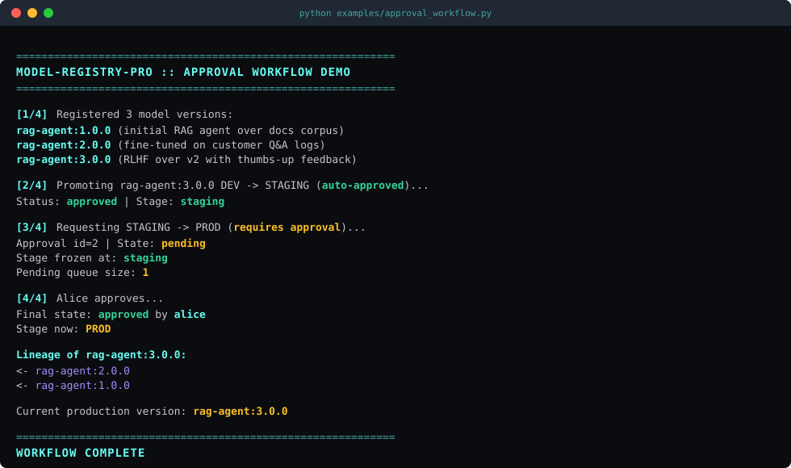
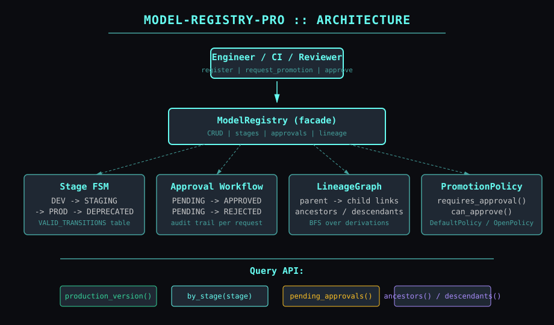
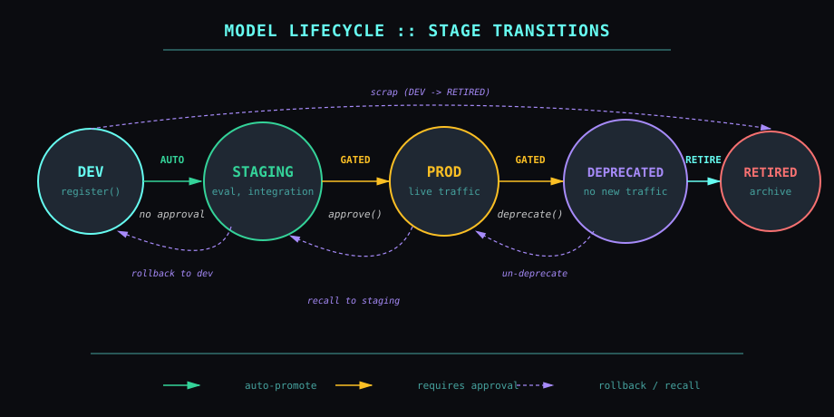

# model-registry-pro 🗂️

> Model lifecycle catalog for AI agents: versions, lineage, stage promotion, and approval gates.
> Audit-friendly governance for *which version is in prod, who approved it, and what came before*.

[](https://github.com/mizcausevic-dev/model-registry-pro/actions/workflows/ci.yml)


---

## Demo

A complete approval workflow: register three lineage-linked model versions,
auto-promote DEV -> STAGING, request STAGING -> PROD with mandatory review,
approve, and confirm the new production version:



## Why

Every team running AI agents in production keeps the same things in spreadsheets,
sticky notes, or Slack DMs:

- *Which model version is actually in prod right now?*
- *Who approved that?*
- *What was it derived from? What's it derived into?*
- *Can we even roll back to the previous version cleanly?*

When auditors, compliance, or your own incident response team asks - and
they will - the answer can't be "let me dig."

**model-registry-pro is the tiny, embeddable governance layer that makes those
questions trivial.**

## What

Six primitives, zero runtime dependencies:

| Component | Purpose |
|---|---|
| `ModelVersion` | Frozen `(name, version)` identity for any registered artifact |
| `Model` | Metadata wrapper with description, parent lineage link, tags, and provenance |
| `Stage` | Lifecycle FSM: DEV -> STAGING -> PROD -> DEPRECATED -> RETIRED |
| `Approval` | Audit-trailed promotion request with requester, approver, timestamps, notes |
| `LineageGraph` | Parent/child queries: ancestors, descendants, BFS over derivations |
| `ModelRegistry` | Facade combining all of the above with a pluggable `PromotionPolicy` |

## Architecture



## Lifecycle FSM

Stage transitions are controlled - not every move is allowed, and most are gated by policy:



## Install

```bash
pip install model-registry-pro
```

Or from source:

```bash
git clone https://github.com/mizcausevic-dev/model-registry-pro
cd model-registry-pro
pip install -e ".[dev]"
pytest
```

## Quickstart

### Register a lineage chain

```python
from model_registry_pro import ModelRegistry, Model, ModelVersion, DefaultPolicy

registry = ModelRegistry(policy=DefaultPolicy(approvers={"alice", "bob"}))

# Base model
v1 = Model(version=ModelVersion("rag-agent", "1.0.0"), description="initial release")
registry.register(v1)

# Fine-tuned descendant
v2 = Model(
    version=ModelVersion("rag-agent", "2.0.0"),
    description="fine-tuned on customer logs",
    parent=v1.version,
    metadata={"params": "1.5B", "training_corpus": "customer-2024-q4"},
)
registry.register(v2)
```

### Promote with approval gate

```python
from model_registry_pro import Stage

# DEV -> STAGING is auto-approved (default policy)
registry.request_promotion(v2.version, Stage.STAGING, requested_by="dev1")
assert registry.stage_of(v2.version) == Stage.STAGING

# STAGING -> PROD requires a designated approver
pending = registry.request_promotion(
    v2.version, Stage.PROD,
    requested_by="dev1",
    notes="passed eval suite, p95 latency = 380ms",
)
# pending.state == ApprovalState.PENDING; stage NOT yet changed

# Reviewer approves
registry.approve(pending.id, approved_by="alice", notes="LGTM")
assert registry.stage_of(v2.version) == Stage.PROD
```

### Query the catalog

```python
# What's currently serving production traffic?
prod = registry.production_version("rag-agent")  # -> Model(rag-agent:2.0.0)

# What's pending review?
queue = registry.pending_approvals()             # -> List[Approval]

# Lineage queries
ancestors = registry.ancestors(v2.version)       # -> [Model(rag-agent:1.0.0)]
children = registry.descendants(v1.version)      # -> [Model(rag-agent:2.0.0)]

# Filter by stage
in_dev = registry.by_stage(Stage.DEV)
deprecated = registry.by_stage(Stage.DEPRECATED)
```

### Custom policy

```python
from model_registry_pro.policy import OpenPolicy

# No approvals required (useful for staging environments / tests)
registry = ModelRegistry(policy=OpenPolicy())

# Or write your own:
class TwoPersonRule:
    def requires_approval(self, mv, current, target):
        return target == Stage.PROD

    def can_approve(self, approver, mv, target):
        return approver in {"alice", "bob", "carol"}
```

## Buyer

- **Platform / MLOps** - drop-in catalog for the model fleet
- **Compliance / Audit** - deterministic answer to "who approved what when"
- **SRE** - safe rollback path - `production_version()` is always the source of truth

## Pairs With

- [`agent-canary`](https://github.com/mizcausevic-dev/agent-canary) - registry says what versions exist, canary controls who sees which
- [`agent-router`](https://github.com/mizcausevic-dev/agent-router) - look up `production_version()` to dispatch traffic
- [`identity-mesh`](https://github.com/mizcausevic-dev/identity-mesh) - approval requester / approver identities can be SPIFFE-bound
- *Coming:* `agent-trace-ledger` - link inference traces back to the exact model version + approval id

## Roadmap

- [ ] Persistence backend (SQLite / Postgres / DynamoDB adapters)
- [ ] Webhook on stage transitions (Slack / PagerDuty / GitHub)
- [ ] Rich semver comparator (currently lexicographic)
- [ ] Model artifact storage adapter (S3, GCS) with content hashing
- [ ] Approval policy from declarative YAML
- [ ] PyPI release

## Doctrine

> *"In production AI, the question is never 'what model do we use' - it's 'what model
> do we use right now, who said yes, and what's the rollback path.'"*

Three rules:

1. **Every promotion is a record.** No silent stage changes. Every state move has an audit row.
2. **Lineage is mandatory metadata.** A model without a parent declaration is fine; a model with a forgotten parent isn't.
3. **Production is a stage, not a deploy event.** Knowing what's in prod must be a single function call, not a Slack thread.

## License

MIT - see [LICENSE](./LICENSE).

---

Built by [Mirza Causevic](https://github.com/mizcausevic-dev) - Part of the
[mizcausevic-dev](https://github.com/mizcausevic-dev) AI platform engineering portfolio.
